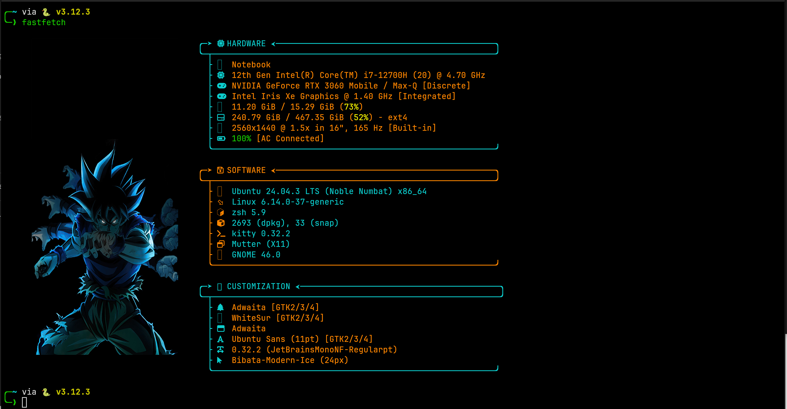

# CS HUB Fastfetch Themes

A curated collection of **Fastfetch themes** with image support and multiple layout styles, designed for a modern and clean terminal experience.

This project provides **8 themes**, each with **2 different layouts** (`sample_1` and `sample_2`), along with an **interactive installer** that lets you choose a theme and layout easily.

---

## ✨ Features

- 🎨 **8 Themes** with unique background images  
- 🧩 **2 Layout Styles per theme**
  - `sample_1` → Compact layout
  - `sample_2` → Extended layout
- 👀 **Screenshot preview** for every theme and layout
- ⚙️ **Interactive installer** (no manual copying required)
- 📦 Automatic installation of `fastfetch` if missing
- 📁 Clean and portable configuration structure
- 🖥️ Optimized for wide terminals

---

## 📸 Preview

Each theme includes screenshots for both layouts.  
Below is an example preview. More screenshots are available in the `screenshots/` directory.

### Dragonball – Sample 1


### Dragonball – Sample 2


---

## 🎨 Available Themes

| Theme | sample_1 | sample_2 |
|------|----------|----------|
| Dragonball | ✔️ | ✔️ |
| Dragonball 2 | ✔️ | ✔️ |
| Onepeace | ✔️ | ✔️ |
| Sasaki | ✔️ | ✔️ |
| Misi | ✔️ | ✔️ |
| CS HUB | ✔️ | ✔️ |
| Abo Obida | ✔️ | ✔️ |
| Cristiano Ronaldo | ✔️ | ✔️ |

---

## 🧩 Layout Styles Explained

- **sample_1**  
  Compact layout with tighter spacing and focused information blocks.

- **sample_2**  
  Extended layout with wider spacing and clearer section separation.

The background image remains the same — only the information layout changes.

---

## ✅ Requirements

To get the best experience, make sure you have:

- **Linux system**
- **Fastfetch**
- **Kitty terminal** (required for image rendering)
- **Nerd Font** (required for icons)

> ⚠️ Image rendering is not supported in all terminals.  
> Kitty and similar GPU-accelerated terminals are required.

---

## 🖥️ Installing Kitty Terminal

Kitty is required for image rendering and previews.

### Ubuntu / Debian
```bash
sudo apt update
sudo apt install -y kitty
```
### Arch Linux
```bash
sudo pacman -S kitty
```
### Fedora 
```bash
sudo dnf install kitty
```
Run Kitty:
```bash
kitty
```

---

### Installing Nerd Font (Required)

#### Icons and box characters require a Nerd Font.

### Recommended Font

JetBrainsMono Nerd Font

### Install the font
```bash
mkdir -p ~/.local/share/fonts
cd ~/.local/share/fonts
wget https://github.com/ryanoasis/nerd-fonts/releases/latest/download/JetBrainsMono.zip
unzip JetBrainsMono.zip
fc-cache -fv
```

#### Configure Kitty to use the font
```bash
mkdir -p ~/.config/kitty
nano ~/.config/kitty/kitty.conf
```

Add:
```bah
font_family JetBrainsMono Nerd Font
```
Restart Kitty after saving.

#### Verify font installation
```bash
echo "      "
```
If icons appear correctly, the font is set up properly.

---

### 🚀 Easy Installation (Recommended)
This project includes an interactive installer that handles everything for you.
### 1️⃣ Clone the repository
```pash
git clone https://github.com/alhattami0/cs-hub-fastfetch.git
cd cs-hub-fastfetch
```
### 2️⃣ Run the installer
```bash
chmod +x install.sh
./install.sh
```
### 3️⃣ What the installer does
Ensures required directories exist

Installs fastfetch if it is missing

Lets you select a theme

Lets you select a layout style

Applies the configuration automatically

After installation, run:
```bash
fastfetch
```
----

### 🖥️ Recommended Terminal Size
For best visual results:

Minimum: 100x25

Recommended: 120x30

---

### 📁 Project Structure
```bashcs-hub-fastfetch/
├── assets/        # Theme images
├── configs/       # Fastfetch configuration files
├── screenshots/   # Preview images for each theme/layout
├── install.sh     # Interactive installer
├── README.md
└── LICENSE
```
---
### 📝 Notes

All configuration paths are relative, making them portable.

You can re-run the installer at any time to switch themes or layouts.

Screenshots are named to match their configuration files exactly.

---

### 📖 Learn More About Fastfetch

If you are new to Fastfetch, check out this detailed guide:
https://itsfoss.com/fine-control-fastfetch/

### 📜 License

This project is licensed under the MIT License.

---

Enjoy customizing your terminal 🚀
If you find this project useful, consider giving it a ⭐
